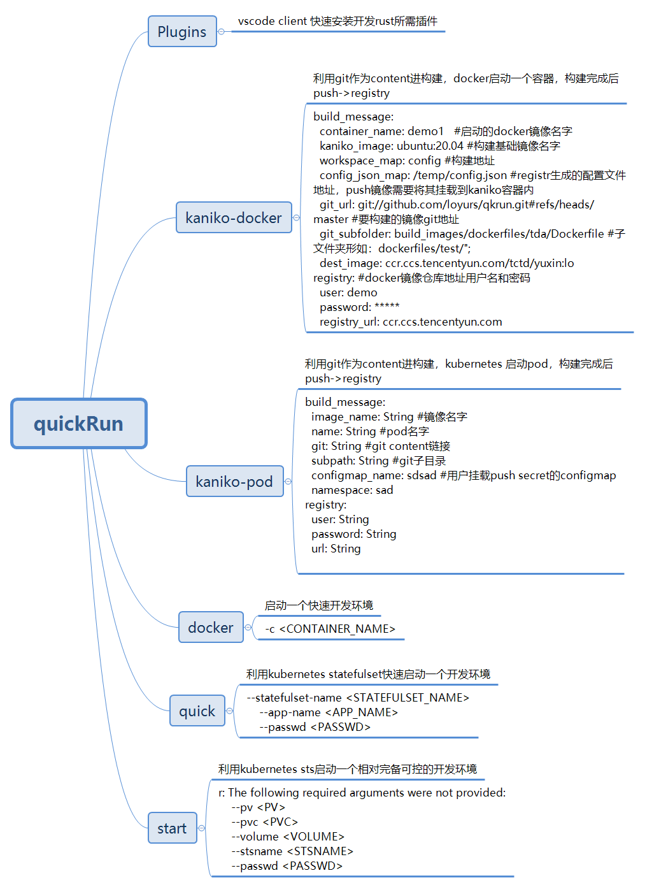

## 功能介绍
1. 利用容器、kubernetes、linux快速构建远程开发环境
2. 自动生成构建极简配置文件



## ENV
```
$HOME/.kube/config存在，try_default 将使用默认配置去连接kubernetes的api
```
## cli用法
```yaml
1 0.1.1
loyu loyurs@163.com
make a containerd vscode-server

USAGE:
    quickrun <SUBCOMMAND>

OPTIONS:
    -h, --help       Print help information
    -V, --version    Print version information

SUBCOMMANDS:
    docker           start container with ssh ubuntu20.04<docker>
    help             Print this message or the help of the given subcommand(s)
    kaniko-docker    构建镜像,或生成配置模板<docker>
    kaniko-pod       构建镜像,或生成配置模板<kubernetes>
    plugins          vscode-client remotessh install tools<vscode>
    quick            start a statefulset container quickly<kubernetes>
    start            start a statefulset <kubernetes>
```